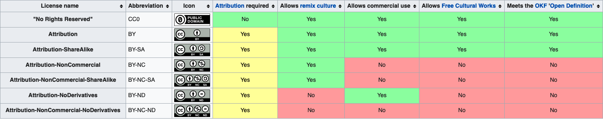

# Licenses 

This document summarizes some of the available licenses for [copywritable works](#creative-commons-license), licenses for [source code](#code-licenses), as well as licenses created specifically to deal with the [publishing and sharing of data](#data-licenses). 

Note this does not apply to subjects related brain imaging data originating from the European Union. Group level derived data (agregated values, images, etc) can however be licensed that way (see public sector directive https://en.wikipedia.org/wiki/Directive_on_the_re-use_of_public_sector_information#Open_data_licensing). For subjects related brain imaging data originating from the European Union, datasets must be shared using a Data Use agreement (e.g. https://open-brain-consent.readthedocs.io/en/stable/gdpr/data_user_agreement.html) and, if shared outside the EU, users must additionally sign the [EU standard contractual clauses](https://ec.europa.eu/info/law/law-topic/data-protection/international-dimension-data-protection/standard-contractual-clauses-scc/standard-contractual-clauses-international-transfers_en).

## Creative Commons Licenses

In it's most condensed form Creative Common Licenses can be seen at this [wikipedia page](https://en.wikipedia.org/wiki/Creative_Commons_license#Types_of_license)

Licenses are delinated by the number of "baseline rights" that they grant, those being:

- Attribution or **BY**
- Share-alike or **SA**
- Non-commercial or  **NC**
- No Derivative works or **ND**

Licenses are listed in order of least restrictive to most restrictive, with
CC0 having 0 additional attachements and Attribution-NonCommercial-NoDerivatives (BY-NC-ND) being the most restrictive.

The matrix[1] below summarizes them very nicely if you don't wish to read further:

The brief summaries and license deeds were collected from [2] and are aggregated below.

### CC Brief summaries

- [CC0](#cc0) no rights reserved

- [CC BY](#cc-by) This license lets others distribute, remix, adapt, and build upon your work, even commercially, as long as they credit you for the original creation. This is the most accommodating of licenses offered. Recommended for maximum dissemination and use of licensed materials.

- [CC BY-SA](#cc-by-sa) This license lets others remix, adapt, and build upon your work even for commercial purposes, as long as they credit you and license their new creations under the identical terms. This license is often compared to “copyleft” free and open source software licenses. All new works based on yours will carry the same license, so any derivatives will also allow commercial use. This is the license used by Wikipedia, and is recommended for materials that would benefit from incorporating content from Wikipedia and similarly licensed projects.

- [CC BY-ND](cc-by-nd) This license lets others reuse the work for any purpose, including commercially; however, it cannot be shared with others in adapted form, and credit must be provided to you. 

- [CC BY-NC](cc-by-nc) This license lets others remix, adapt, and build upon your work non-commercially, and although their new works must also acknowledge you and be non-commercial, they don’t have to license their derivative works on the same terms.

- [CC BY-NC-SA](cc-by-nc-sa) This license lets others remix, adapt, and build upon your work non-commercially, as long as they credit you and license their new creations under the identical terms.

- [CC BY-NC-ND](cc-by-nc-nd) This license is the most restrictive of the six main licenses, only allowing others to download your works and share them with others as long as they credit you, but they can’t change them in any way or use them commercially. 

---

## Code Licenses 

TODO Add licenses here

---

## Data Licenses 

Creative Commons recommends not sharing databases with their CC licenses unless using CC0[5]. The Open Knowledge Foundation has created 3 different additional licenses to accomodate the
open sharing of databases, their contents, and derivative works[6].

Those three Licenses are:

- [ODbL 1.0 license](#odbl)
- [ODC-BY 1.0 license](#odbc-by)
- [Public Domain Dedication and License 1.0](#pddl)

### OpenData Commons Summaries

---

### Open Data Commons Open Database License (ODbL) 

This is a human-readable summary of the [ODbL 1.0 license](https://opendatacommons.org/licenses/odbl/1-0/).

#### You are free to:

- To share: To copy, distribute and use the database.

- To create: To produce works from the database.

- To adapt: To modify, transform and build upon the database.

#### Under the following terms:

- Attribute: You must attribute any public use of the database, or works produced from the database, in the manner specified in the ODbL. For any use or redistribution of the database, or works produced from it, you must make clear to others the license of the database and keep intact any notices on the original database.

- Share-Alike: If you publicly use any adapted version of this database, or works produced from an adapted database, you must also offer that adapted database under the ODbL.

- Keep open: If you redistribute the database, or an adapted version of it, then you may use technological measures that restrict the work (such as DRM) as long as you also redistribute a version without such measures.

---

### Open Data Commons Attribution License (ODC-By) 

This is a human-readable summary of the [ODC-BY 1.0 license](https://opendatacommons.org/licenses/by/1-0/).

#### You are free to:

- To share: To copy, distribute and use the database.

- To create: To produce works from the database.

- To adapt: To modify, transform and build upon the database.

#### Under the following terms:

- Attribute: You must attribute any public use of the database, or works produced from the database, in the manner specified in the license. For any use or redistribution of the database, or works produced from it, you must make clear to others the license of the database and keep intact any notices on the original database.

---

### Open Data Commons Public Domain Dedication and License (PDDL) 

This is a human-readable summary of the [Public Domain Dedication and License 1.0](https://opendatacommons.org/licenses/pddl/1-0/).

#### You are free:

- To share: To copy, distribute and use the database.
- To create: To produce works from the database.
- To adapt: To modify, transform and build upon the database.

#### As long as you:

- Blank: This section is intentionally left blank. The PDDL imposes no restrictions on your use of the PDDL licensed database.

---

## Conforming with NIH Policy for Data Management and Sharing

The updated NIH Data sharing and management policy is structured aroud the principles of FAIR [3] that is:

    Improving the Findablity, Accessibility, Interoperability, and Reuse of digitial assets.

This link will take you to the [full text](source/NIH_data_policy_2023.md)[4].

In the opinion of this writer the three most applicable licences for CC works that conform to the NIH data policy are these:

- [CC0](#cc0)
- [CC BY](#cc-by)
- [CC BY-SA](#cc-by-sa)

## License Deeds

### CC0 

#### No Copyright

The person who associated a work with this deed has dedicated the work to the public domain by waiving all of his or her rights to the work worldwide under copyright law, including all related and neighboring rights, to the extent allowed by law.

You can copy, modify, distribute and perform the work, even for commercial purposes, all without asking permission. See Other Information below.

#### Other Information

- In no way are the patent or trademark rights of any person affected by CC0, nor are the rights that other persons may have in the work or in how the work is used, such as publicity or privacy rights.
- Unless expressly stated otherwise, the person who associated a work with this deed makes no warranties about the work, and disclaims liability for all uses of the work, to the fullest extent permitted by applicable law.
- When using or citing the work, you should not imply endorsement by the author or the affirmer.

---

### Attribution 4.0 International (CC BY 4.0) 

#### You are free to:

- Share — copy and redistribute the material in any medium or format

- Adapt — remix, transform, and build upon the material for any purpose, even commercially.

- This license is acceptable for Free Cultural Works.

The licensor cannot revoke these freedoms as long as you follow the license terms.

#### Under the following terms:

- Attribution — You must give appropriate credit, provide a link to the license, and indicate if changes were made. You may do so in any reasonable manner, but not in any way that suggests the licensor endorses you or your use.

- No additional restrictions — You may not apply legal terms or technological measures that legally restrict others from doing anything the license permits.

### Notices:

- You do not have to comply with the license for elements of the material in the public domain or where your use is permitted by an applicable exception or limitation.
   
- No warranties are given. The license may not give you all of the permissions necessary for your intended use. For example, other rights such as publicity, privacy, or moral rights may limit how you use the material.

---

## Attribution Share Alike (CC BY-SA 4.0) 

### You are free to:

- Share — copy and redistribute the material in any medium or format
- Adapt — remix, transform, and build upon the material for any purpose, even commercially.

The licensor cannot revoke these freedoms as long as you follow the license terms.

### Under the following terms:

- Attribution — You must give appropriate credit, provide a link to the license, and indicate if changes were made. You may do so in any reasonable manner, but not in any way that suggests the licensor endorses you or your use.

- ShareAlike — If you remix, transform, or build upon the material, you must distribute your contributions under the same license as the original. 

- No additional restrictions — You may not apply legal terms or technological measures that legally restrict others from doing anything the license permits.

---

## Attribution-NoDerivs (CC BY-ND 4.0) 

### You are free to:

- Share — copy and redistribute the material in any medium or formatfor any purpose, even commercially.

The licensor cannot revoke these freedoms as long as you follow the license terms.

### Under the following terms:

- Attribution — You must give appropriate credit, provide a link to the license, and indicate if changes were made. You may do so in any reasonable manner, but not in any way that suggests the licensor endorses you or your use.

- NoDerivatives — If you remix, transform, or build upon the material, you may not distribute the modified material.

- No additional restrictions — You may not apply legal terms or technological measures that legally restrict others from doing anything the license permits.

---

## Attribution-NonCommercial 4.0 International (CC BY-NC 4.0) 

### You are free to:

- Share — copy and redistribute the material in any medium or format

- Adapt — remix, transform, and build upon the material

The licensor cannot revoke these freedoms as long as you follow the license terms.

### Under the following terms:

- Attribution — You must give appropriate credit, provide a link to the license, and indicate if changes were made. You may do so in any reasonable manner, but not in any way that suggests the licensor endorses you or your use.

- NonCommercial — You may not use the material for commercial purposes.

- No additional restrictions — You may not apply legal terms or technological measures that legally restrict others from doing anything the license permits.

---

## Attribution-NonCommercial-ShareAlike 4.0 International (CC BY-NC-SA 4.0) 

### You are free to:

- Share — copy and redistribute the material in any medium or format

- Adapt — remix, transform, and build upon the material

The licensor cannot revoke these freedoms as long as you follow the license terms.

### Under the following terms:

- Attribution — You must give appropriate credit, provide a link to the license, and indicate if changes were made. You may do so in any reasonable manner, but not in any way that suggests the licensor endorses you or your use.

- NonCommercial — You may not use the material for commercial purposes.

- ShareAlike — If you remix, transform, or build upon the material, you must distribute your contributions under the same license as the original.

- No additional restrictions — You may not apply legal terms or technological measures that legally restrict others from doing anything the license permits.

---

## Attribution-NonCommercial-NoDerivatives 4.0 International (CC BY-NC-ND 4.0) 

### You are free to:

- Share — copy and redistribute the material in any medium or format

The licensor cannot revoke these freedoms as long as you follow the license terms.

### Under the following terms:

- Attribution — You must give appropriate credit, provide a link to the license, and indicate if changes were made. You may do so in any reasonable manner, but not in any way that suggests the licensor endorses you or your use.

- NonCommercial — You may not use the material for commercial purposes.

- NoDerivatives — If you remix, transform, or build upon the material, you may not distribute the modified material.

- No additional restrictions — You may not apply legal terms or technological measures that legally restrict others from doing anything the license permits.

## Sources
1. Creative Commons, https://creativecommons.org/licenses/
2. Wikipedia Creative Commons License, https://en.wikipedia.org/wiki/Creative_Commons_license#Types_of_license
3. Fair Principles, https://www.go-fair.org/fair-principles/
4. NIH Data Sharing Policy,https://grants.nih.gov/grants/guide/notice-files/NOT-OD-21-013.html
5. Open Data Commons Licenses FAQ, https://opendatacommons.org/faq/licenses/
6. Open Data Commons, https://opendatacommons.org/licenses/
